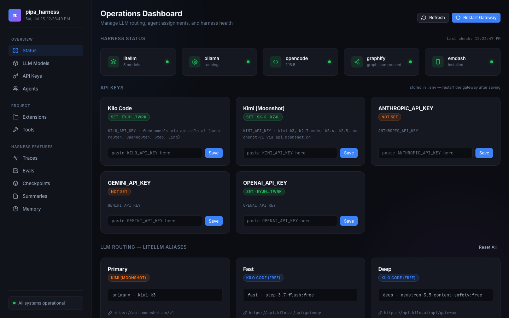

# pipa_harness


**A project-agnostic, runtime-agnostic agent harness, installed once and shared by every project.**
LiteLLM + graphify + Obsidian behind a thin `pipa` CLI; projects carry only a thin `.pipa/` overlay of markdown facts — no runtime configs, ever.

## Why

- **Free-tier-native** — runs at $0: local Ollama models are the always-on fallback tier; cloud providers activate only when their API key is present.
- **Runtime-agnostic** — OpenCode or DeepSeek Harness per project (`pipa runtime set`); both share one session bus, one model gateway, one memory.
- **Flight recorder** — every runtime appends to one NDJSON log; replay any session or diff two sessions (same task, two models) with `pipa replay` / `pipa diff`.
- **Agent CI** — a GitHub Action gates PRs on agent evals, so editing agent markdown can't silently drop approval gates or golden rules.
- **One-query memory** — `pipa recall "why did we choose X"` fans out over project memory, the install vault, and the code graph with expiry-aware ranking.

## Quick start

```bash
# Option A: one command (clean machine)
curl -fsSL https://raw.githubusercontent.com/lugaol/pipa-harness/main/bootstrap.sh | bash

# Option B: clone + install
git clone https://github.com/lugaol/pipa-harness.git && cd pipa-harness
make -C install                   # rsync working tree -> ~/.pipa-harness
make -C ~/.pipa-harness/install path   # put pipa on $PATH (idempotent)

# Wire tools + services (litellm :4000, ollama, dashboard :8080)
pipa up

# Adopt any project
cd /path/to/your-project
pipa init                          # thin .pipa/ overlay, idempotent

# Run an agent runtime in that project
opencode                           # OpenCode TUI
dsh web                            # DeepSeek Harness Web UI
```

Update later with `make -C ~/.pipa-harness update` (git pull --ff-only).

## Adopt in your project

`pipa init` creates a thin overlay. It never touches global wiring and never overwrites existing files:

```
.pipa/
  AGENTS.md        project facts only (loaded alongside the global router)
  runtime          selected runtime name: opencode | deepseek-harness
  rules/*.md       project rules — load together with global rules
  skills/          optional project skills — same name beats the global skill
  agents-local/    project-level agents (exposed to OpenCode via symlink)
  memory/
    decisions/     dated decisions (as_of / valid_until)
    research/      external findings
  state/           session.log.ndjson, traces.db, memory.db (gitignored)
AGENTS.md -> .pipa/AGENTS.md   (symlink created by pipa init)
```

Legacy layout? Run `pipa migrate` to fold `.harness_extension/` into `.pipa/`.

### Global vs project

| Concern | Global install (~/.pipa-harness) | Project (.pipa/) |
|---------|----------------------------------|------------------|
| Router | `AGENTS.md` always loaded | project-facts `AGENTS.md`, loaded alongside |
| Rules | `rules/*.md` | `.pipa/rules/*.md` (both apply) |
| Skills | `skills/*/SKILL.md` | `.pipa/skills/` wins on same name |
| Memory | `vault/` | `.pipa/memory/` searched first |
| Models | live provider discovery + gateway | nothing |
| Runtime config | wired machine-global | nothing — never stored in projects |

## CLI reference

```bash
pipa init [--runtime R]        # scaffold .pipa/ in the current project
pipa up [--no-apps|--no-pull]  # install deps, start services, wire configs
pipa stop                      # stop services started by pipa
pipa status [--json]           # health check (exit 1 on failure)
pipa runtime list|show|set R   # inspect / switch the project runtime
pipa migrate                   # legacy .harness_extension/ -> .pipa/
pipa hook <event> [args...]    # append to the NDJSON session bus
pipa replay [SID]              # flight recorder: replay a recorded session
pipa diff A B                  # compare two sessions (same task, two models)
pipa recall "<query>"          # one query over project memory + vault + code graph
pipa spend [--since TS] [--json]  # token/cost ledger (metadata-only NDJSON)
pipa eval                      # run agent behavioral evals
pipa install <component>       # uv|ollama|litellm|graphify|dsh|opencode|apps
```

## Models & keys

Model lists are **discovered live from providers** — nothing is hardcoded:

- `pipa.providers` queries each provider's model-listing endpoint (Ollama,
  OpenCode Zen, OpenRouter `:free`, Kilo free, Moonshot) and caches the
  result in `state/model_catalog.json`
- Refresh happens on `pipa up` and via the dashboard's
  **Refresh from providers** button; only models reported by the provider
  are ever routed
- Which model backs each tier (`lowest..xhigh`) is your call, made in the
  dashboard Models page — nothing is auto-classified
- `models/settings.yaml` — shared gateway settings (spend ledger callback lives here)
- Composer output: `models/.effective.yaml` (generated, gitignored), consumed by the LiteLLM proxy

| Tier | Use for |
|------|---------|
| `lowest` | read-only codebase Q&A, triage |
| `low` | QA verdicts, summaries |
| `mid` | implementation, dev agent |
| `high` | research, planning, architecture |
| `xhigh` | hardest reasoning, long-horizon work |

Tiers are **user-assigned** in the dashboard (Models page), and each agent can
get its own tier on the Agents page.

Cloud keys: `KILO_API_KEY`, `KIMI_API_KEY`, `OPENROUTER_API_KEY`,
`OPENCODE_ZEN_API_KEY`. No keys? You are still fully functional on Ollama.

## MCP registry

One folder per integration: `mcp/<name>/config.json`. Enabled entries merge into the rendered runtime config at wire time; adding an integration means dropping a folder — nothing else changes.

- `context7/` — enabled by default
- `bitbucket/`, `jira/`, `figma/` — disabled placeholders awaiting credentials (env vars, never git)

See [mcp/README.md](mcp/README.md) for the schema.

## Dashboard

Starts with `pipa up` at `http://localhost:8080`. Modular FastAPI pages:

overview · sessions · spend · models · agents · projects · memory · evals



## Flight recorder

```bash
pipa replay                 # list recorded sessions across all runtimes
pipa replay s3              # step through one session
pipa diff s3 s7             # same task, two models — tool calls, tokens, cost side by side
```

The underlying contract is documented in [docs/SESSION_BUS.md](docs/SESSION_BUS.md).

## Agent CI

PRs touching `agents/**` run the behavioral eval suite before merge — transparency blocks, approval gates, golden rules all pinned as tests.

```yaml
- uses: lugaol/pipa-harness@main
  with:
    evals-path: tools/evals/run.py   # default
    fail-on-error: "true"            # default
```

[](https://github.com/lugaol/pipa-harness/actions/workflows/agent-evals.yml)

Details: [docs/AGENT_CI.md](docs/AGENT_CI.md). The action itself is [action.yml](action.yml).

## Layout

Install root (`~/.pipa-harness`) and this repo share one tree:

```
AGENTS.md            always-loaded router (the only injected context)
rules/               path-scoped rules (git, testing, security, code-review)
skills/              trigger-loaded skills (debugging, release, performance, ...)
agents/              subagents: analyst -> pm -> architect -> sm -> dev -> qa, explorer, researcher
clis/                per-runtime templates + wire entries: opencode/, deepseek-harness/
models/              LiteLLM settings.yaml -> .effective.yaml (generated; model lists discovered from providers, cached in state/)
mcp/                 MCP integration registry (<name>/config.json)
tools/               evals/, litellm/, memory_store/, ollama/, tracing.py
dashboard/           FastAPI app: pages/, fragments/, templates/ (:8080)
pipa/                Python CLI lib: cli, config, runtime, scaffold, services, hooks, recall, spend
install/             Makefile + steps/ (deps, core, runtimes, apps, wire)
bin/                 pipa entrypoint
bootstrap.sh         one-command installer (curl | bash)
action.yml           Agent CI action (gates PRs on agent evals)
tests/               conformance + behavior suite (pins every config contract)
specs/               two-phase plan->story workflow output
vault/               dated memory (decisions, research) with as_of/valid_until
state/               SESSION.md (warm resume), PLAN.md (task ledger), spend ledger
docs/                SESSION_BUS.md, AGENT_CI.md, ARCHITECTURE.md
```

## Development

Run the test suite (pins config contracts: dynamic discovery/composition, runtime wiring, hooks schema, recall ranking, spend ledger):

```bash
uv run --with pytest --with pyyaml --with fastapi --with uvicorn --with jinja2 --with httpx python -m pytest tests/ -q
```

## License

Apache-2.0 — see [LICENSE](LICENSE).
